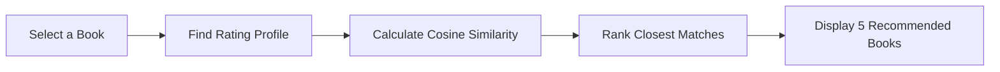

# 📚 Book Recommender System

> **Pick a book you love. Discover your next favorite read.**

[](https://www.python.org/)
[](https://flask.palletsprojects.com/)
[](https://render.com/)

A Flask-powered book discovery application that uses collaborative filtering to recommend books with similar reader-rating patterns. Browse popular titles, explore the complete catalog, or enter any book title to get 5 personalized recommendations.

<p align="center">
  <a href="#-features">Features</a> ·
  <a href="#-how-it-works">How It Works</a> ·
  <a href="#-quick-start">Quick Start</a> ·
  <a href="#-deployment">Deployment</a>
</p>

---

## ✨ Features

| Feature | Description | Page |
| --- | --- | --- |
| ⭐ **Top 50 Books** | Explore the most popular and highest-rated books | Home page (`/`) |
| 🔎 **Live Search** | Autocomplete title search with instant suggestions | Recommendation page (`/recommend`) |
| 🪄 **Smart Recommendations** | Get 5 similar book suggestions based on user rating similarity | Recommendation page (`/recommend`) |
| 🗂️ **Complete Catalog** | Browse every book available in the recommender system | All Books page (`/all_books`) |

---

## 🧠 How It Works



The recommendation engine uses a precomputed collaborative-filtering similarity matrix. For a chosen title, it looks up the book in the reader-rating matrix, computes similarity scores against other books, and returns the top 5 closest recommendations with title, author, and cover image.

---

## 🚀 Quick Start

### 1. Clone the repository

```bash
git clone https://github.com/YOUR_USERNAME/Book-recommender-system.git
cd Book-recommender-system
```

### 2. Create and activate a virtual environment

```bash
# Windows
python -m venv .venv
.venv\Scripts\activate

# macOS / Linux
python3 -m venv .venv
source .venv/bin/activate
```

### 3. Install dependencies & run locally

```bash
pip install -r requirements.txt
python app.py
```

Open **http://127.0.0.1:5000** in your browser. 🎉

> [!IMPORTANT]
> Make sure `popular.pkl`, `pt.pkl`, `books.pkl`, and `similarity_score.pkl` remain in the root folder. These precomputed model files are required when the app starts.

---

## 🌐 Deployment Guide

### Option 1: Deploy on Render (Free & Recommended)

This repository includes a `Procfile` (`web: gunicorn app:app`) and `requirements.txt` for automatic 1-click deployment on Render.

1. Push your code to GitHub.
2. Go to [Render.com](https://render.com/) and create a free account.
3. Click **New +** → **Web Service** → Connect your GitHub repository.
4. Fill in the deployment details:
   - **Environment:** `Python 3`
   - **Build Command:** `pip install -r requirements.txt`
   - **Start Command:** `gunicorn app:app`
   - **Instance Type:** `Free`
5. Click **Create Web Service**. Render will deploy your app automatically!

---

### Option 2: Deploy on PythonAnywhere (Free)

1. Register at [PythonAnywhere.com](https://www.pythonanywhere.com/).
2. Open a **Bash Console** and clone your repository:
   ```bash
   git clone https://github.com/YOUR_USERNAME/Book-recommender-system.git
   cd Book-recommender-system
   pip install -r requirements.txt
   ```
3. Go to the **Web** tab → Create a new Flask web app pointing to `app.py`.
4. Click **Reload**.

---

## 🛠️ Tech Stack

| Layer | Technology |
| --- | --- |
| **Backend** | Python, Flask, Gunicorn |
| **Machine Learning & Data** | pandas, NumPy, scikit-learn, Pickle |
| **Frontend** | HTML5, CSS3, JavaScript |
| **Deployment** | Render / PythonAnywhere (Procfile) |

---

## 🗺️ API & Web Routes

| Route | Method | Description |
| --- | --- | --- |
| `/` | GET | Displays top 50 popular books dashboard |
| `/recommend` | GET | Book recommendation search page |
| `/recommend_books` | POST | Accepts `user_input` and returns 5 similar books |
| `/search_books?q=<query>` | GET | Live search autocomplete suggestions |
| `/all_books` | GET | Complete catalog of available books |

---

## 📁 Project Structure

```text
.
├── app.py                  # Main Flask web application & recommendation logic
├── requirements.txt        # Python dependencies (Flask, NumPy, pandas, Gunicorn)
├── Procfile                # Gunicorn startup configuration for cloud deployment
├── popular.pkl             # Precomputed data for top 50 popular books
├── pt.pkl                  # Pivot table mapping user ratings to books
├── books.pkl               # Complete book metadata catalog
├── similarity_score.pkl    # Precomputed cosine similarity matrix
├── README.md               # Project documentation
└── templates/              # HTML Templates
    ├── index.html          # Popular books home page
    ├── recommend.html      # Book search & recommendation page
    └── all_books.html      # All books catalog page
```
